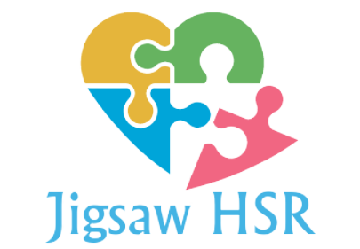

<p align="center">
  
</p>

<h1 align="center">🧩 Jigsaw - The Ultimate Puzzle Challenge</h1>

<p align="center">
  <strong>A premium, interactive Jigsaw Puzzle game built with Java Swing.</strong><br>
  Challenge your mind, track your time, and solve beautiful high-resolution puzzles.
</p>

<p align="center">
  
</p>

---

## 🌟 Overview

**Jigsaw** is a feature-rich puzzle game designed to provide a smooth and engaging user experience. Whether you're a casual player or a puzzle master, Jigsaw offers multiple difficulty levels and a variety of stunning images to choose from. Built with a custom UI and smooth animations, it brings the classic tabletop experience to your screen.

---

## 🎨 Key Features

- **🖼️ Image Gallery**: Select from built-in high-quality images like Space (Nasa), Wildlife, and more.
- **⚡ Multiple Difficulty Levels**:
  - **Easy**: 3x3 Grid (9 pieces)
  - **Medium**: 4x4 Grid (16 pieces)
  - **Hard**: 5x5 Grid (25 pieces)
  - **So Hard**: 6x6 Grid (36 pieces)
- **⏳ Dynamic Timer & Ranking**: Track your time and try to beat the "Least Elapsed Time" record stored for each difficulty.
- **⏯️ Game Controls**: Pause, Resume, and Restart functionality at your fingertips.
- **🔊 Immersive Audio**: Reward sounds when you're on the right track and when you win the game!
- **✨ Smooth Animations**: Moving and scaling animations for a polished feel.
- **💻 Custom UI**: A sleek, undecorated frame with custom minimize/close buttons and a beautiful theme.

---

## 🚀 How to Play

1.  **Launch the Game**: Run the `Start.java` class or the provided JAR file.
2.  **Pick Your Image**: Choose from the available puzzle images.
3.  **Select Difficulty**: Choose your grid size (3x3 to 6x6).
4.  **Solve the Puzzle**: 
    - Click a piece to select it (it will show a red border).
    - Click another piece to swap their positions.
    - Match all pieces to their original positions before the time runs out!
5.  **Win!**: Complete the puzzle to see your time and move to the next level.

---

## 🛠️ Technical Details

- **Language**: Core Java (JDK 8+)
- **Graphics**: Swing & AWT for high-performance rendering.
- **UI Architecture**: Custom-built `PuzzlePanel` using `GridLayout` and `FilteredImageSource` for dynamic image cropping.
- **Data Persistence**: Local `input.txt` file for storing and retrieving high scores.

---

## 📁 Project Structure

```text
Jigsaw/
├── src/puzzle/          # Java Source Files
│   ├── Start.java       # Entry Point & Main Menu
│   ├── SetLevel.java    # Level & Image Selection
│   ├── PuzzlePanel.java # Core Game Logic
│   └── ...
├── resources/
│   ├── images/          # Assets (GIFs, PNGs, JPGs)
│   └── audio/           # Sound effects (winner.wav)
├── build.xml            # Ant Build Configuration
└── README.md            # This file!
```

---

## 📦 Win Preview

<p align="center">
  
  
  
</p>

---

<p align="center">
  Designed and Developed by <strong>soumia</strong>.<br>
  Built with ❤️ and Java.
</p>